# Import and convert 
Before we can start co-registering the scans, the raw data needs to be imported and converted in RiSCAN PRO. This will create a *.RiSCAN folder separate from the raw data folder (which will not be altered). 

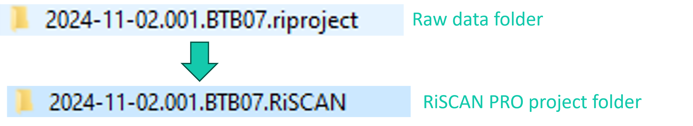

## Steps

1. To import and convert the raw data click *Help ?*. 
2. Click *Wizard ‘Download and convert’*.

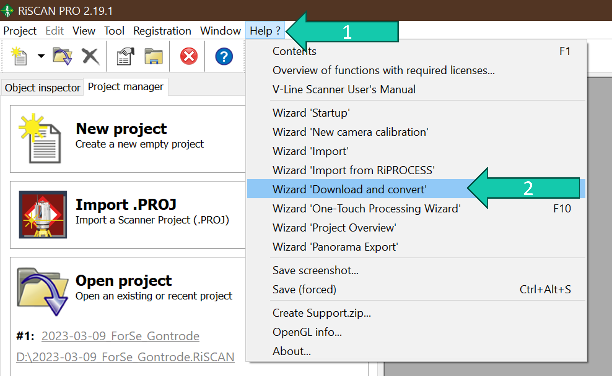

3. Select the raw data (*.riproject folder) that you want to process.
4. Click *Select*.

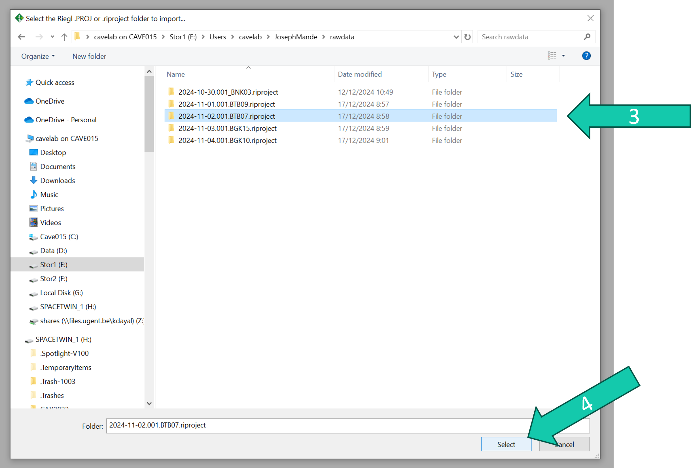

5. The project name will automatically be the same as the folder name (-.riproject) but this can be changed if wanted.
6. Choose the folder where you want to store the project.
7. Click *Next*.

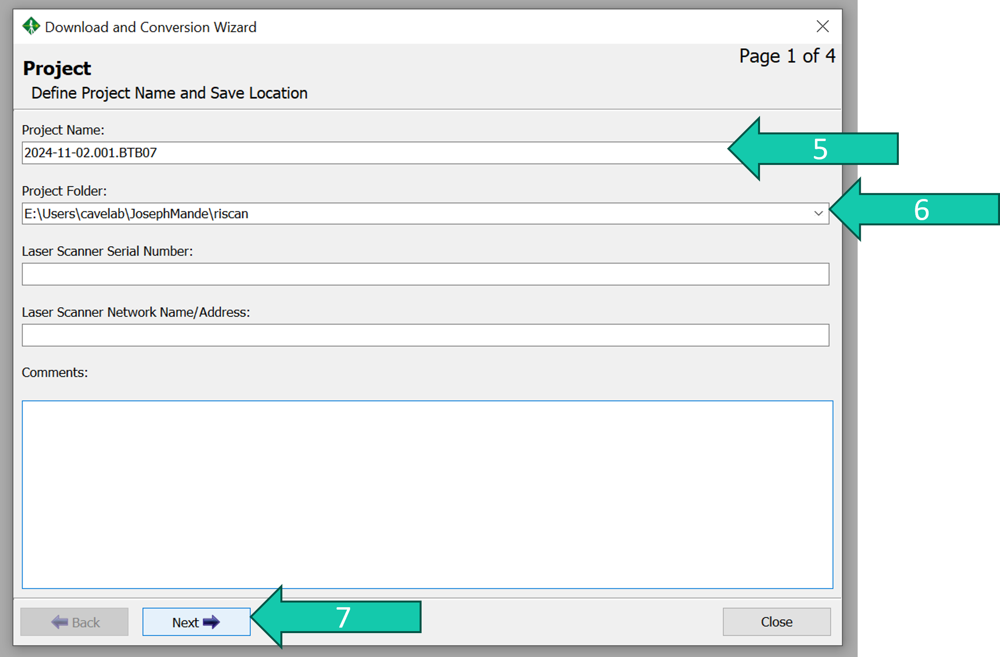

8. Click *Next*.

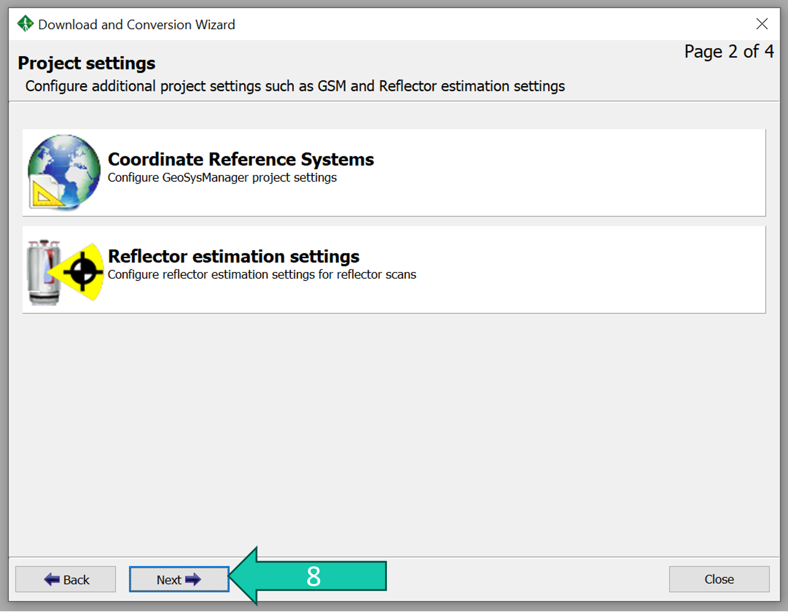

9. Right-click the project name.
10. Click *Check all* to select all scans. 
11. Click *Next*.

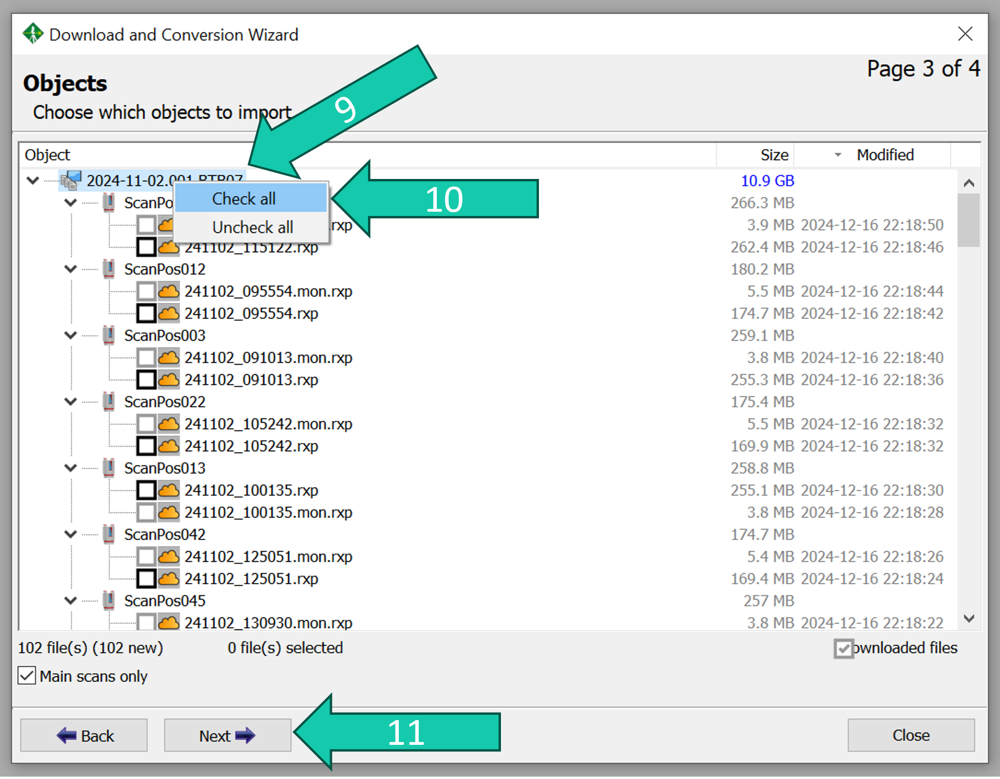

12. When the import progress is 100% click Close.

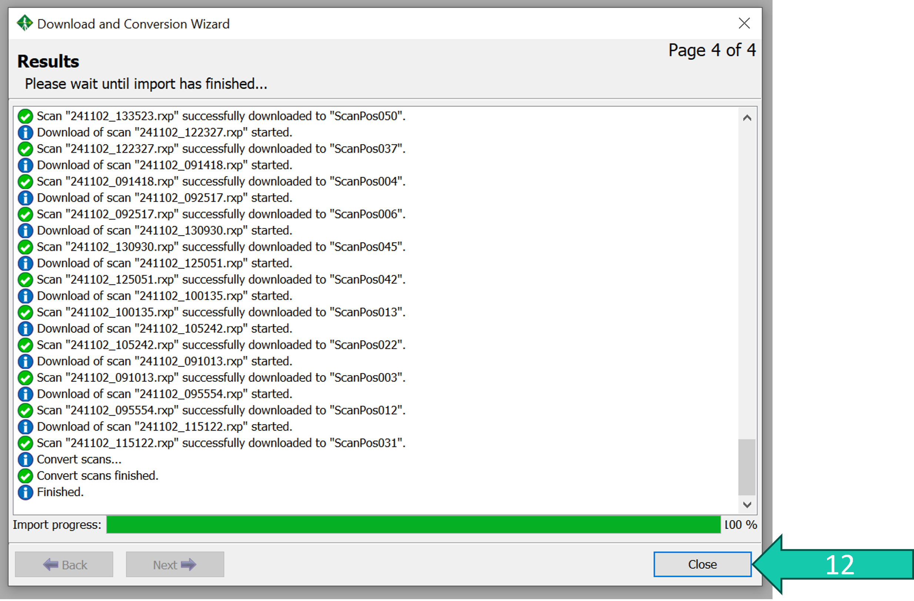

In the Project manager tab you can find all the data and objects. 

13. The most important folder is *SCANS*.
14. There you can find all the scan positions (*ScanPosXXX*).
15. The actual point cloud/scan in each scan position is indicated by the cloud symbol. The name of this file refers to the date and time the scan was taken. 

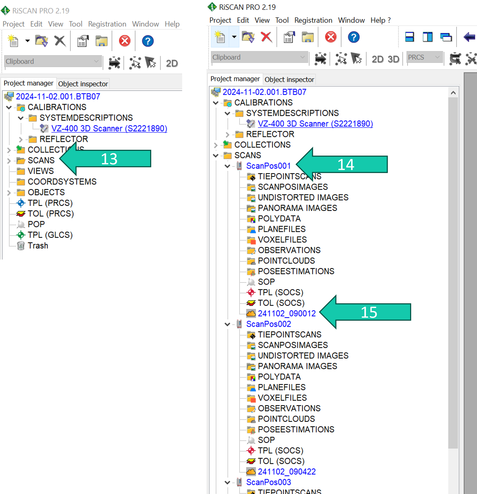

If the scan positions are in a strange order (e.g. not increasing from ScanPosition001 to ScanPosition002 etc.):

16. Right-click *SCANS*. 
17. Click *Sort*.

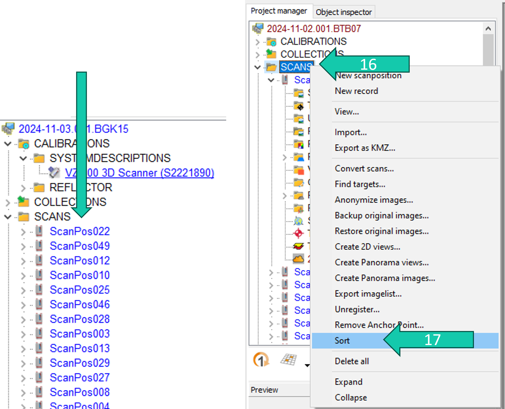

The orientation and position of the sensor during each scan is saved as a matrix in the SOP (Sensor's Orientation and Position) object of each scan position. 
This matrix changes when we co-register the different scan positions.

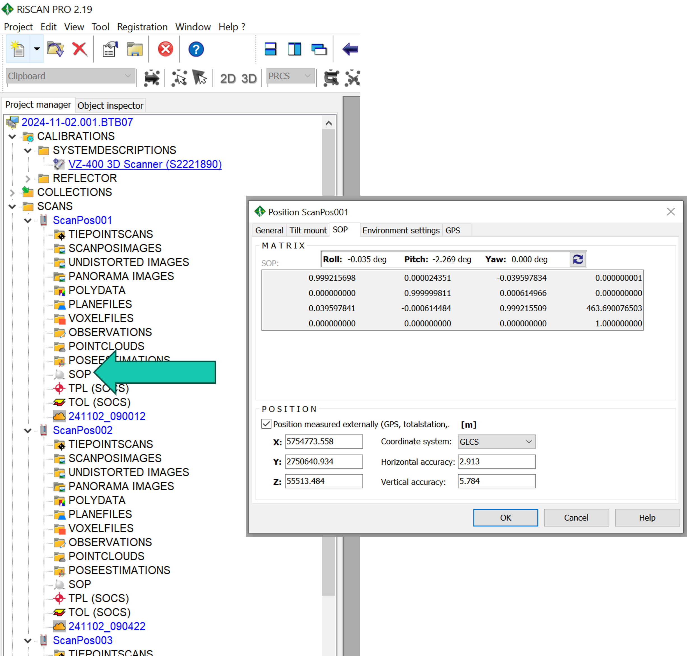

Before co-registration of the different scan positions we first determine the coordinate system of the first scan position which serves as our reference scan position to which the other scan positions will be aligned.

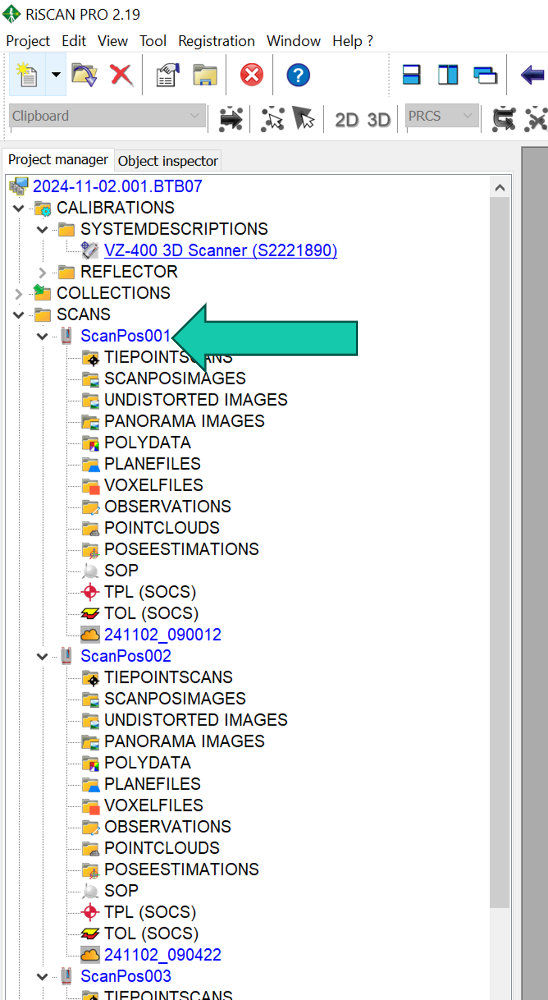

18. Right-click *SOP*.
19. Click *Calculate via inclination sensors...*. 
20. Make sure it is set to *Use reference scan*.
21. Click *next* & *OK*.

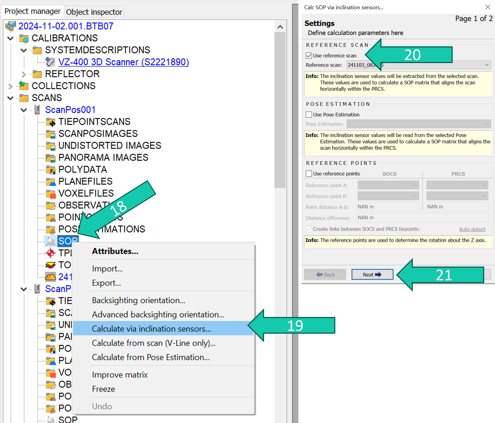

22. Right-click *SOP*.
23. Click *Calculate from scan (V-Line only)…* Click *OK*.
24. Do step 1. again and click *Freeze* (when SOP is frozen it can't be changed).
25. A *star symbol* will appear next to ScanPos001 indicating the SOP is frozen, and the *globe symbol* indicates it’s registered.

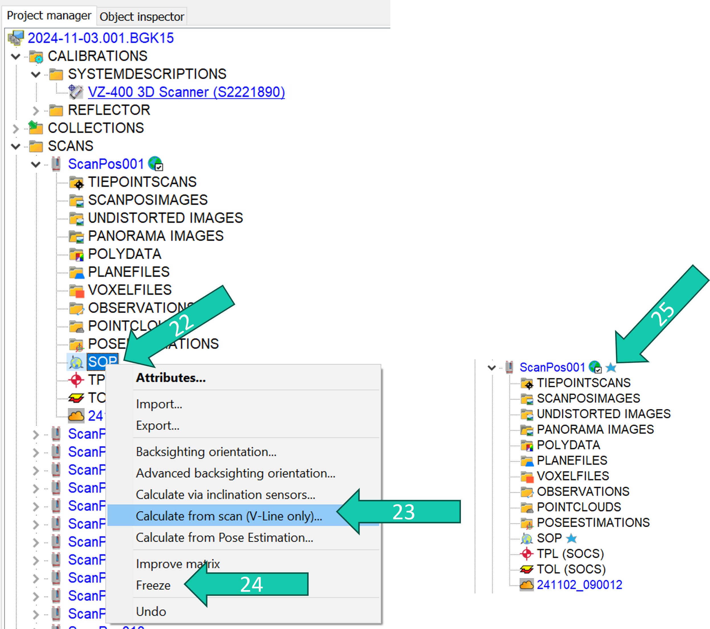
