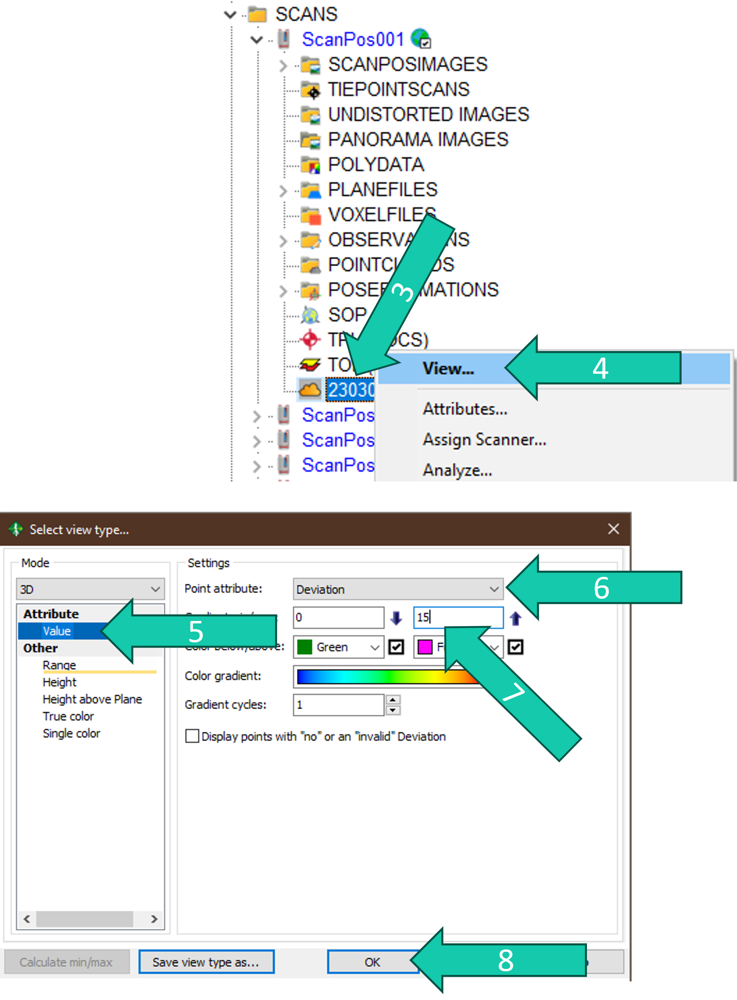

# Clean and filter
## Clean
Sometimes (when there was wind or an error occurred during scanning in the field) multiple scans are conducted within one scan position or in separate scan positions. As we only need a single good scan, we delete the "bad" point clouds/scan positions. 

> The last point cloud/scan position is often the "good" one (in the example on the right the 029B will be the good one). But make sure you check by checking the field sheet and/or looking at the point cloud in the preview window (after clicking on the point cloud).

### Steps

1. Right-click the scan position or point cloud which needs to be deleted.
2. Click *Delete & confirm*.

## Filter

The point clouds in each scan position contain a lot of points and a big part of these point are of "bad" quality/noise. These points are characterised by a high deviation value (deviation quantifies the comparison of the recorded waveform with the stored reference shapes and this value increases for overlapping pulses or slanted targets). 

### Steps

How to choose a max deviation value? Generally, we use a value between 12 and 20, standard 15. You can choose a value yourself by visualising and comparing the point cloud with different max deviation values to see the difference. 

3. Right-click a point cloud.
4. Click *View*.
5. Click *Value*.
6. Choose *Deviation*.
7. Change the max value.
8. Click *OK*.

9. Select all the point clouds.
10. Right-click on the point cloud.
11. Click on *Create pointcloud...*.

12. Check *by Attribute*. 
13. Indicate *Deviation less than* 15 (this is what we use standard but can be case dependent).
14. Check *Copy to new file*.
15. Indicate an *Output suffix* such as "_dev15" so it is clear how you created this point cloud.
16. Make sure *Combine data* is **un**checked and click *OK*. 

17. The point clouds with only points with a deviation < 15 end up under *POINTCLOUDS* for each scan position. These are the point clouds we will work with from now on (except to find the reflectors).

### Alternative steps
Alternatively, you could also use the One-touch processing wizard to filter your scans:

1. Click the *wizard symbol*.
2. Check Task: *Filter Scans*.
3. Click on the *gear symbol*.

4. Check *Keep all echos per laser shot*.
5. Check *Delete points with Deviation above*. And fill in 15. Make sure the other filter settings are unchecked.
6. Check *Keep filtered points as backup (move to new point cloud)*.
7. Click *OK*.
8. Make sure all other tasks in the wizard are unchecked and click *Start*.

In this case the filtered version of the point cloud will be the cloud indicated by arrow 1 and the points that were deleted from that point cloud are found in POINTCLOUDS (arrow 9).
So if you use this method the next steps will have to be performed on the point cloud indicated by arrow 10. Pay attention to this as the next main steps assume the previous option was used!

I recommend using the previous option.

