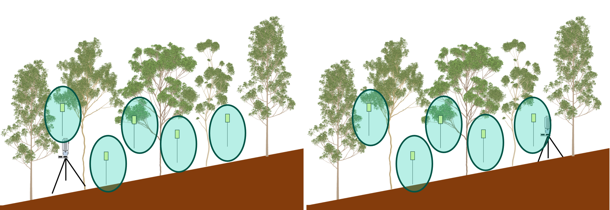
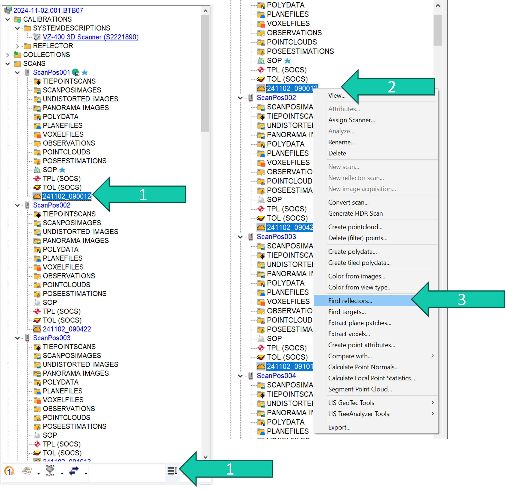
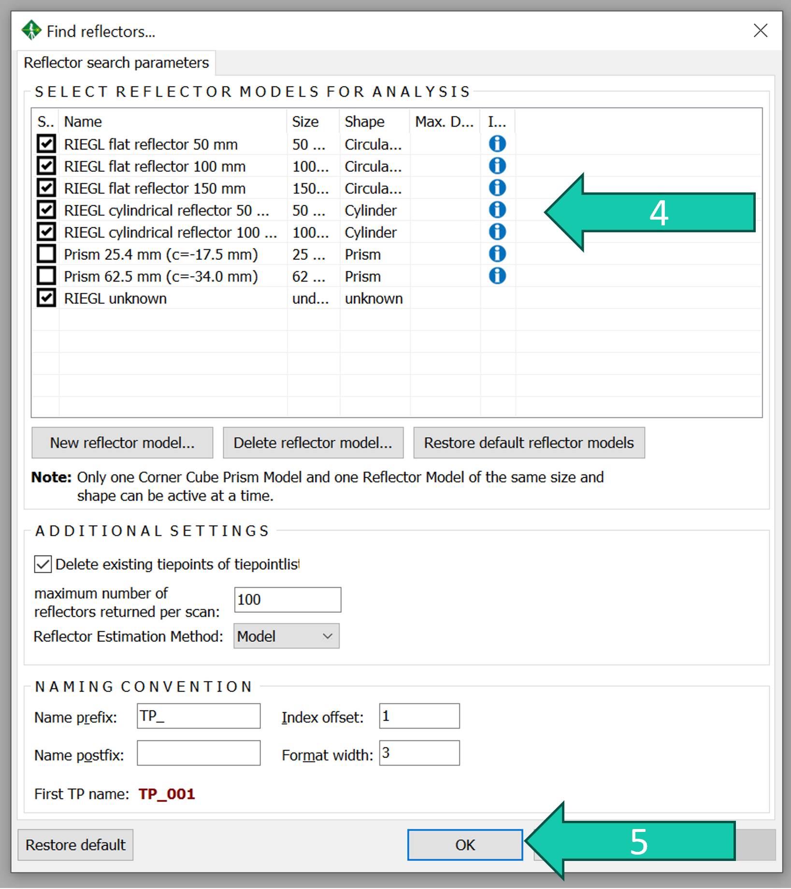
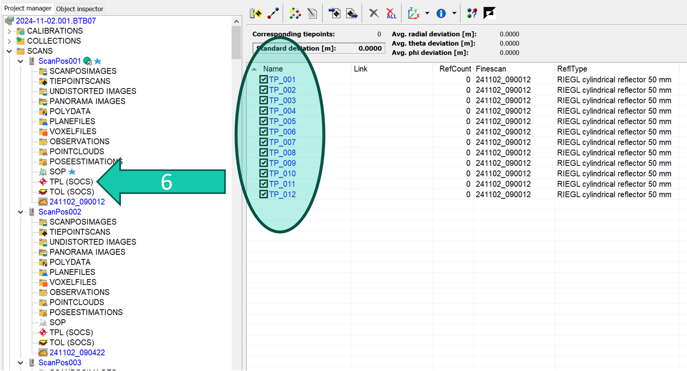

# Find reflectors
In order to perform the coarse co-registration the reflectors placed in the forest need to be identified in the different scans.

## Steps

1. Select all the point clouds by selecting one and clicking on the *"select all" symbol**.
2. Right-click on the point clouds.
3. Click on *Find reflectors...*.

> *this might not work on a froozen point cloud so select a different point cloud and try again and manually select the frozen point cloud (with ctrl + click).

4. Check all the RIEGL reflectors (this will increase the chance that reflectors are found).
5. Click OK.

6. The reflectors which are found for each scan position appear in TPL (tiepointlist), you can see them by double-clicking on TPL.

