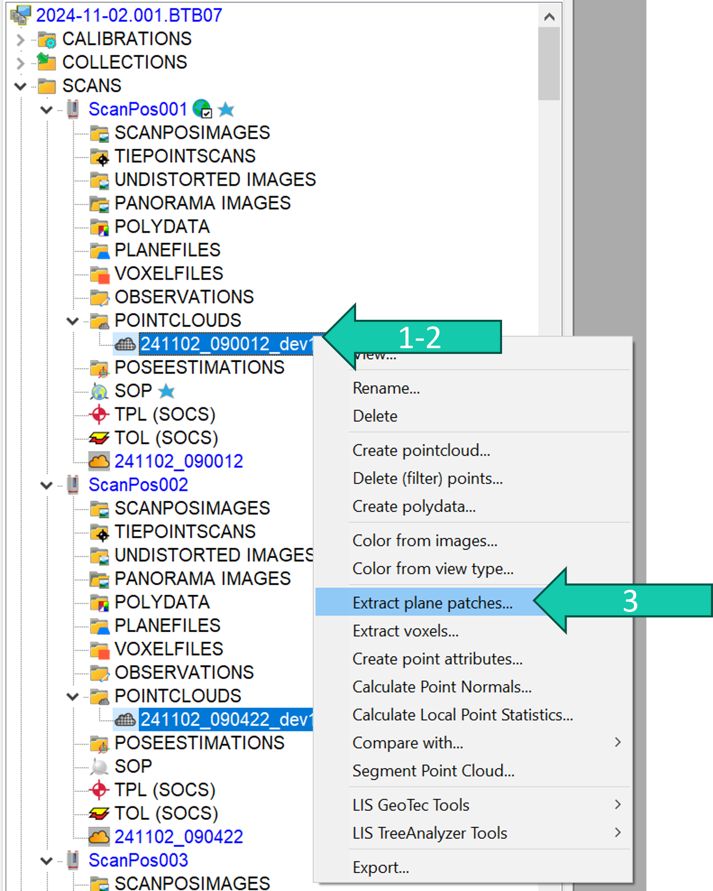
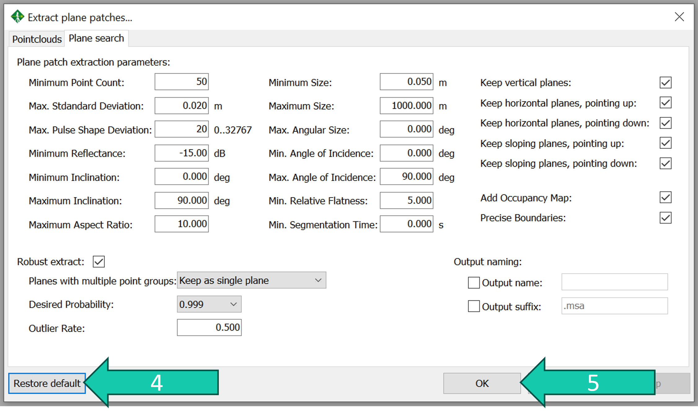
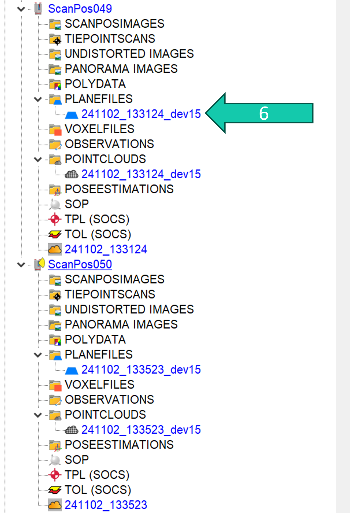

# Make plane patches
In order to perform the fine co-registration using the MSA algorithm we first need to calculate plane patches from each scan.

## Steps

1. Select all the filtered point clouds under *POINTCLOUDS* by clicking on one and clicking on     *"select all" symbol*.
2. Right-click on the filtered point cloud.
3. Click on *Extract plane patches...*.

1. Default parameters are generally good enough for co-registration of TLS data, click *Restore default* to make sure the parameters are the default ones.
2. Click *OK*.

6. The plane patches can be found under *PLANEFILES* for each scan position.

