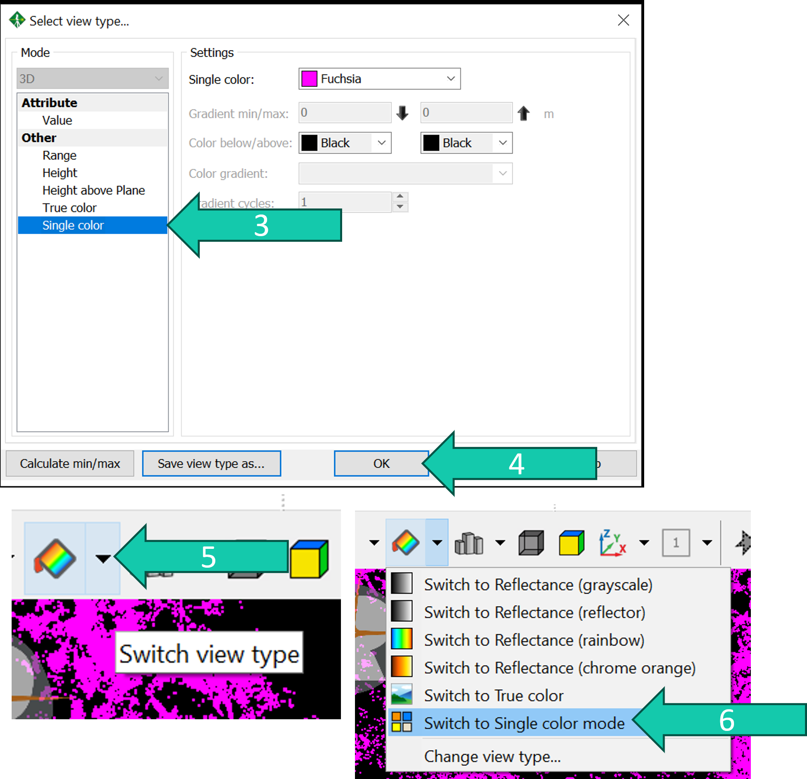
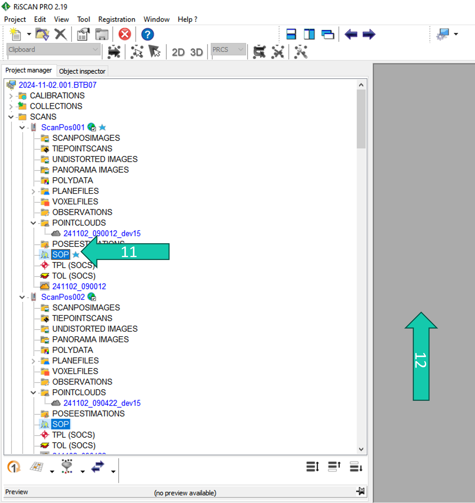

# Coarse co-registration with tiepoints
The coarse co-registration consist basically of aligning scans based on common reflectors that were put in the field. 

In practice, we perform 2 scans at each location (one up, one tilted) and then move to the next location while also moving half of the reflectors. Therefore the up and the tilted scans at one location can always be linked to each other using the reflectors AND they can be linked to the scans of the previous and next location. 

While doing this coarse co-registration we follow the same sequence as how the scans were done:
* ScanPos001 is the reference (and registered), 
* ScanPos002 is linked* to ScanPos001, 
* ScanPos003 can be linked to ScanPos001 and ScanPos002, 
* ScanPos004 can be linked to ScanPos001 and ScanPos002 and ScanPos003, 
* ScanPos005 can be linked to ScanPos003 and ScanPos004, etc. 

*Using the coarse co-registration algorithm, you can only link a scan position to those that previously have been registered.

1. We want to co-register/align ScanPos002 to ScanPos001 which is our registered reference. The *globe symbol* indicates that this scan position has been registered.
2. Double-click *TPL* under ScanPos002. 
3. Click on *Find corresponding points...*.

4. Check ScanPos001 as this is the only "registered" scan position which ScanPos002 has reflectors in common with. 
5. Set the parameters. To begin the tolerance can be set for example to 0.2 and minimum N to 4.
6. Click Start. Now the algorithm will search for solutions to match the reflectors (tie points) found in ScanPos002 to those found in ScanPos001.

7. This gives you all the solutions found with the first one usually the best one. It says it could match 12 tiepoints. This is likely to be a good solution. 

To be sure you can visualise the point clouds of ScanPos001 and ScanPos002 to confirm (see next slides). OR if you know the pattern of the scans you could also just visualise the SOPs (select them and drop them into the viewer).

## Visualisation intermezzo

Visualising the point clouds:
1. Select the point clouds you want to visualise. 
2. Right-click on one of the point clouds.
3. Click on *View...* (or drag and drop them into the grey area).

4. Choose the setting Single color.
5. Click OK.
6. Click Switch view type.
7. Click Switch to Single color mode. This will show the point clouds of different scan positions in different colors.

8. Use the scroller to zoom in and out of the point cloud.
9. You can use the *Height filter* to slice the point cloud to better focus on certain parts of the point cloud.
10. You can make horizontal slices (Z), or vertical slices (X or Y) through the point cloud. 
11. You can change the height range and thickness of the slices.
12. Play around with this a bit.

The two colors are coarsely matching meaning it is a good solution.

You can also just visualise the SOPs
13. Select the SOPs you want to visualise. 
14. Drag and drop them into the grey area.

15. Click on Orthogonal view: this will give you grid lines where you can see the scan positions locations (which are 10 m apart as expected here). Moreover, even and uneven scan positions (e.g 001 and 002) are on top of eachother as these are the upright and tilted scans at one location.

## Back to coarse co-registration steps 

8. If the solution is good you click *OK*.
9. If the solution is not good you can click on *Next solution*. And you check if it is better. You can keep clicking till a good solution is found.
10. If you run out of solutions without finding a good one you click on *Settings*. Increase the tolerance with 0.1. If this does not work you can also decrease the Minimum N to 3. This is a bit of a trial and error process. 
11. If it still does not find any good solutions, manual methods will need to be used.

# Coarse co-registration done manually
Sometimes it is impossible to coarsely co-register some scan positions using the previously explained method. This can happen when too many reflectors were not visible in a scan. In that case you need to manually fix the co-registration.

There are two cases:
* Problems with co-registration of the tilted scan. This can be easily fixed when the upright scan at the same location is registered.
* Problems with co-registration of the upright scan. This is more tricky. 

## Steps
### Fixing case 1 (tilted scan) - option 1
One way to manually co-register a tilted scan is by manually picking tiepoints in the upright and tilted scan at the same location.

First we need to visualise the upright and tilted scan in 2D view:
1. Right-click the point clouds of the scan position you want to co-register. 
2. Click *View*. 

3. Click *2D*.
4. Click *Reflectance*. 
5. Click *OK*.
6. Right-click the point cloud of the upright scan position at the same location (so the previous scan position)
7. Click *View*. 
8. Click *2D*.
9. Click *Reflectance*.
10. Click *OK*.

11. Rotate the tilted scan view so it's similar to the upright scan view.

12. Minimize and adapt the screen sizes so you can see both views next to each other.

Move around in the view to get a similar area in both views. Zoom in on a similar object in both views.

13. Right-click on that object in one of the views
14. Click *Create tiepoint here*.
15. Click *OK*.
16. Do the same in the other view on the same object.
17. Repeat the process in the previous slide approximately three to five times, choosing objects at different heights and ranges. 
18. Then rotate the tilted scan again to see the other side of the scan and repeat step 1. 

Now you have created a number of additional tiepoints in both the (registered) upright scan and the unregistered tilted scan. You can go back to the coarse registration steps and try to find corresponding tiepoints again. 

### Fixing case 2 (upright scan) - option 1
One way to fix an upright scan is by manually moving the scan position to the right spot.

But before we do this we want the scan position to be “tilted” the right right way (up). This might not be the case after trying coarse registration using the tiepoints. To do this we will use the SOP of the previously registered scan position.

1. Right-click the SOP of the previously registered upright scan position.
2. Click *Export*. Save the SOP in a place you can quickly find again (e.g. Downloads) and save it under a logical name (e.g. sop019.dat).

3. Right-click the SOP of the upright scan position you want to manually co-register.
4. Click *Import*. Choose the previously exported SOP.

Now the scan position will be on the exact same position as the previous upright scan position. And we need to move it towards the spot we think it should be.

5. Visualise the SOPs of all the registered scan positions in the *Orthogonal view* and put the view in *Top view*. (see previous steps). Now you can see the scan pattern. Based on this and your knowledge of the field work estimate where the scan position should approximately be. 
6. Right-click on the scan position you want to move under *POSITIONS* in the *Object inspector*.
7. Click *Modify orientation & position in 3D view…*.

8. Click on the blue shaded area of the blue donut that appeared. And move it to the position you think the scan should be.

You can use a sliced view to see more clearly if the point clouds are also visualised.

9. Look for identical objects in the point cloud of the scan position you want to co-register and the already registered scan positions.
10. Use the blue cylinder to translate (shaded area for X,Y and the arrow for Z) and rotate (the band) the scan position so it matches the other point clouds approximately.
11. Click *Apply*.

Now the upright scan has been very coarsly registered. To indicate this:
12. Right-click the scan position.
13. Click *Registered*.
14. Now use the fine registration steps (MSA1) explained in next chapter to finely co-register the scan position. 

