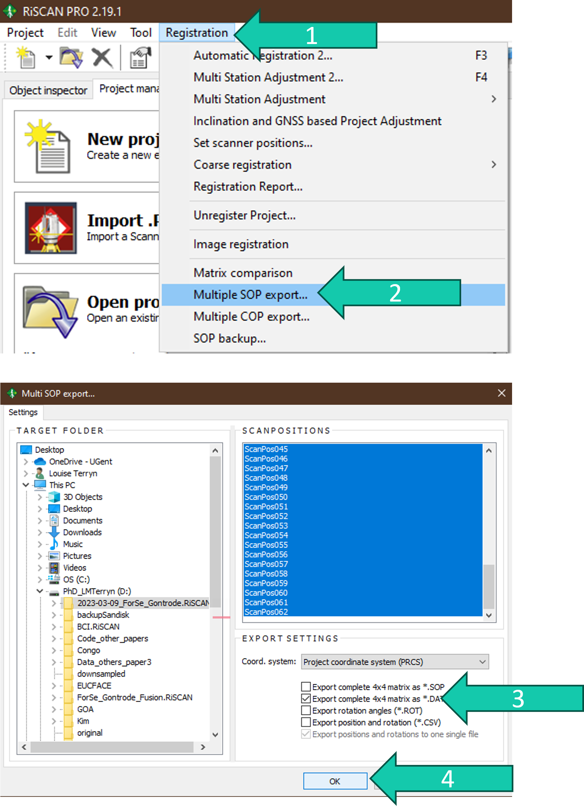

# Save and combine
## Save 
When you have finished the co-registration it is important that you make a backup of the SOP matrices. There are two ways to save the SOPs which you should both perform:
* Saving them separately in .DAT files
* Saving them combined in a CSV file*

This is also essential for your data management which is compulsory in Q-ForestLab.

*You can also do this during the co-registration process when you want the current status of the SOPs to be back-upped. This could be useful before performing MSA on the whole plot as this might also give unwanted results and by saving the SOPs on beforehand you can easily undo the changes made. 

### Steps

#### First way to save SOPs
1. Click on *Registration*.
2. Click on *Multiple SOP export…*.
3. Check the *Export complete 4x4 matrix as *.DAT*. Uncheck the other options.
4. Click *OK*.

If you left the target folder unchanged then the SOP files will end up in the project folder (*.RiSCAN)

#### Second way to save SOPs
1. Click on *Registration*.
2. Click on *SOP backup…*.
3. Choose a good backup name (e.g. dates if you’re making intermediairy backups; name of the .RiSCAN PROject for your final backup).
4. Click *Create backup*.
5. If you ever want to restore a backup, double click the name of the one you want to restore.

The CSV file created by doing the steps in the previous slide ends up in the .RiSCAN folder under *BACKUP > SOP*

## Combine
In a next step you might want to combine the point clouds of all the scan positions into one big point cloud. From this point cloud you can later extract trees or structural features.

This combined point cloud will contain a lot of points, therefore it is often advised to downsample the point cloud. Often a downsampling resolution of 1 cm to 2 cm is used considering the file size, the characteristics of the VZ-400 scanner, and the forest.

### Steps
1. Select all the filtered point clouds under *POINTCLOUDS* by clicking on one and clicking on symbol. 
2. Right-click on the filtered point cloud. 
3. Click on *Create pointcloud...*.

4. Check *Octree*.
2. Choose your *Resolution*.
3. Click *Copy to new file*.
4. Check *Combine data*.
5. Choose an *Output name:*.
6. Click *OK*.

7. The combined point clouds will end up under *OBJECTS > POINTCLOUDS*.

