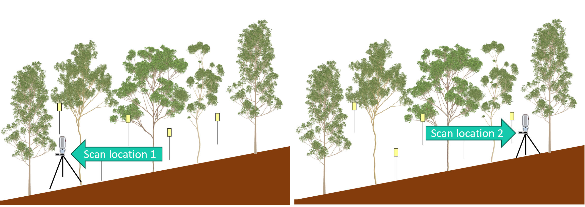
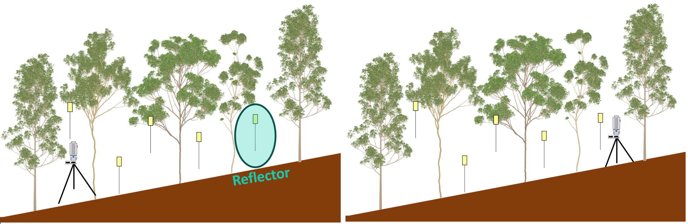

# Manual for the co-registration of RIEGL VZ400 terrestrial laser scanning data in RiSCAN PRO

Within this manual we will use the RIEGL RiSCAN PRO software to co-register TLS data collected with a RIEGL VZ-400 scanner in combination with reflectors. If you have not yet installed the RiSCAN PRO software check the installation manual (insert link). 

This manual works best after reading it through and receiving a demo of this process on one of the computers at the office and then using it to independently process your data. Contact Louise.Terryn@UGent.be for more info. 

This manual is for the VZ-400 scanner (not the VZ-400i scanner, which has upgraded hard -and software, requiring a different approach for co-registration).

## Principles of co-registration
When collecting TLS data of a forest plot, we often collect scans at multiple scan locations/positions to be able to capture the complete forest structure. This results in multiple separate scans/point clouds collected at different locations in the forest, each in their own coordinate system.

However, we want these scans in the same coordinate system (for further processing). Aligning the scans so we can achieve this is what we call co-registration. When using the VZ-400 scanner, reflectors are put in the field during scanning to facilitate this. 

The co-registration process consists of two main parts:
* The **coarse co-registration** where the reflectors (that were put in the field) are used to roughly align the scans. Often an error of a few centimeters remains on this alignment. 
* The **fine co-registration** where that alignment is improved. For the fine/accurate co-registration of the different scan positions, an algorithm (Multi Station Adjustment – MSA*) will be used. This algorithm relies on matching plane patches derived from the various scans. 

*This is different from the “Multi Station Adjustment 2” algorithm which only works for VZ i-series scanners.

## Steps
The whole process consist of multiple steps:

**1. [Preparation](1_preparation.md)** 
**2. [Import & convert ](2_import_convert.md)** 
**3. [Clean & filter](3_clean_filter.md)** 
**4. [Find reflectors](4_find_Reflectors.md)** 
**5. [Make plane patches](5_make_plane_patches.md)** 
**6. [Coarse co-registration with tiepoints](6_coarse_co-registration.md)** 
**7. [Fine co-registration with MSA](7_fine_co-registration.md)** 
**8. [Save & combine](8_save_combine.md)** 

Last major update: 21-02-2025, Louise Terryn